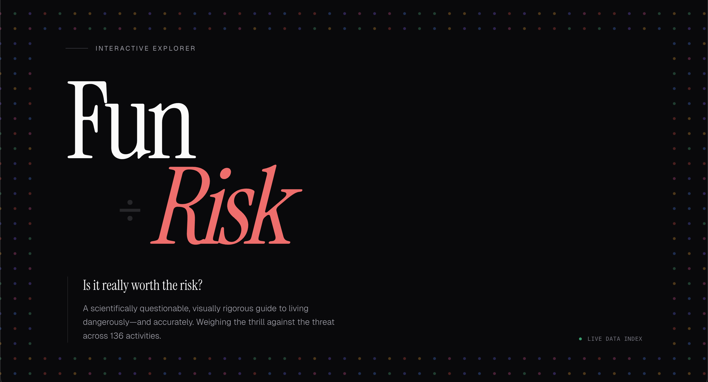

# Fun / Risk
A scientifically questionable guide to living dangerously, accurately.

## Live Demo
https://jeyoungjung.github.io/risk-to-fun/

## Preview


## What is this?
This project scores 136 activities on fun versus risk using peer-reviewed research, actuarial data, and neuroscience. It then compresses that data into numbers you can argue about at dinner. It's a weekend project built to visualize the trade-offs between pleasure and peril.

## Features
- Interactive explorer with search, category filtering, and Worth It sorting.
- Fun versus Risk scatter plot visualization using Recharts.
- Side-by-side activity comparison for up to three items.
- Individual activity deep-dive pages for all 136 activities with static generation.
- Full methodology page detailing scoring algorithms, scientific references, and edge case analysis.
- Mobile responsive design.

## How the scoring works
Full methodology with equations, weight rationale, and edge case analysis is available at /methodology.

- Fun Score (0-100): A weighted composite of subjective pleasure (Kahneman DRM), flow state (Csikszentmihalyi), hedonic purity (Bentham), and dopamine response.
- Risk Score (0-100): Unified health burden using micromorts and microlives, log-normalized and combined with life disruption and legal exposure.
- Worth It Index (0-100): A measure of the magnitude of the deal. 50 represents a break-even point.
- FRR (Fun-to-Risk Ratio): A smoothed ratio with a +15 offset to handle edge cases.

## Tech stack
- Next.js 16 (App Router, static export)
- React 19
- TypeScript
- Tailwind CSS 4
- Base UI (headless components)
- shadcn/ui
- Recharts (scatter plot)
- Vitest (testing)
- GitHub Pages (deployment via GitHub Actions)

## Getting started
```bash
git clone https://github.com/JeyoungJung/risk-to-fun.git
cd risk-to-fun
npm install
npm run dev
```
Open http://localhost:3000

## Project structure
```text
data/
└── activities/
    └── index.json        # All 136 activities with raw scoring inputs
src/
├── app/                  # Next.js App Router pages
│   ├── activity/[slug]/  # Dynamic pages for each activity
│   ├── compare/          # Side-by-side comparison tool
│   └── methodology/      # Full scoring methodology docs
├── components/           # React components
│   ├── ExplorerClient.tsx    # Main activity browser with search/filter
│   ├── ScatterPlot.tsx       # Fun vs Risk scatter plot
│   ├── StickyHeader.tsx      # Site navigation
│   └── ui/                   # shadcn/ui primitives
└── lib/                  # Core logic
    ├── data.ts           # Activity data loading + score computation
    ├── scoring.ts        # Scoring algorithms (FRR, Worth It, tiers)
    └── format.ts         # Display formatters
```

## Scripts
- `npm run dev` - Start development server
- `npm run build` - Production build with static export
- `npm run test` - Run tests with Vitest
- `npm run lint` - Run ESLint

## Deployment
This project automatically deploys to GitHub Pages on every push to the master branch via GitHub Actions.

## Disclaimer
Not medical, legal, or financial advice. This is a data visualization project built in a weekend. The science is real, but the application is for entertainment purposes. Use your own judgment.

## License
MIT. Use it however you want.
